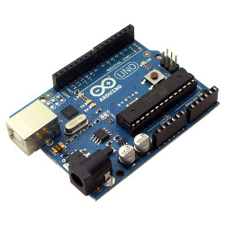
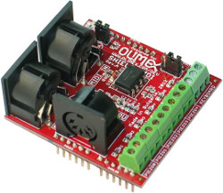
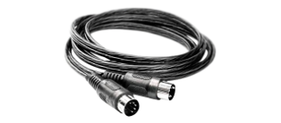
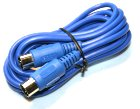
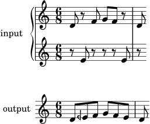
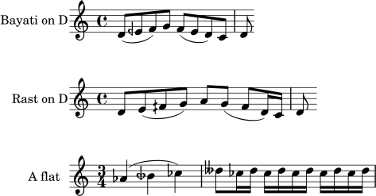

#The Project

This is an arduino project for automated octave switching.
Run it as a proxy between midi out and midi in.

The end result is kind of like manual arpeggiation.  It lets you do
extremely fast scale and arpeggio runs.  It isn't clock based, and doesn't make guesses.
It only plays notes you actually play, but octave switches to the nearest note to the previous note.
In practice it means that jumps up of a fifth or more shift octave down, and jumps down of a fifth or more shift an octave up.

#How To

The keyboard is a quartertone flat below middle C, and designed exclusively for playing mono voices.

Demonstration Video (Not a trained or proficient pianist at all):

Tutorial video on using the quartertone split:

https://www.youtube.com/watch?v=vimtrlz7cGs&feature=autoshare

To build one, install the Arduino SDK:

http://www.arduino.cc

Buy an Arduino Uno, easily available from electronics stores for as low as $5:

>The Uno only has a 2048 bytes of RAM available.
>This current code uses about 512 bytes of RAM.

Buy a MIDI shield for roughly $20.  You typically need to buy them online.  I find them on Amazon (Olimex, LinkSprite).  You only need MIDI IN and OUT for these purposes (you can buy a partial MIDI shield that doesn't have a MIDI THRU, with only IN and OUT if you like):

Stack them together.  Be very careful to align the pins correctly before plugging into USB (ie: the power source), or you can damage the board.  Then use the Arduino SDK to upload [octaveRounder.ino](octaveRounder.ino) into the Arduino boardi over the USB (press the 'Raw' button to get a downloadable link in your browser that you can right click to save-as).
  
>Note that in order to load programs, the MIDI shield usually 
>needs to be disabled with a switch/jumper during the program
>upload phase.  Your synth can also sometimes get into a strange 
>state while being programmed, and may need a reset if you leave
>cables plugged in during programming.  If you try to program
>with the switch on, you may need to press the reset button
>on the Arduino, set the switch for programming, 
>set the COM port again, and retry.

As always with MIDI, make sure that the keyboard is set to transmit MIDI out (usually on channel 1).  Then MIDI OUT from that keys controller into the MIDI IN of the MIDI Shield, and MIDI OUT from the Shield into the MIDI IN of the synth.  If your MIDI keys controller has a disable local keys option, use that.  If you can disable local keys, you can use the same device for keys controller and synth.  You will need 2 MIDI DIN cables, or at least will need the 5-pin DIN on the end that plugs into the Arduino.  Try to use different colors, as you will be unplugging and plugging them in very frequently.  A third cable for MIDI THRU will not be necessary for this pedal, because we don't use the clock signals in this program (ie: like arpeggiators do).
I use a Novation UltraNova for this purpose:

These are two of the prototypes.  One in a red plastic box has a dozen LEDs representing the current note down.
The other is the raw prototyping board for uploading code on a daily basis.  
Some of these have used Arduino Mega 2560, but these just use Arduino Uno.

Once you have all of the parts you need, configure them and plug them together.
This diagram gives a complete inventory of what needs to be done.

>Note that you can make a minimal (and not optically isolated!)
>MIDI shield with two female MIDI DIN connectors and a pair
>of 220 Ohm resistors, but you may judge it to be too
>hazardous for the MIDI device that this is to be plugged into.

#What it does

At a basic level, it is doing automated octave shifting. Musically, it is manipulating a virtual octave switch.
It makes a tremendous difference when octave switching is automated, because the rhythm needs to be right when
moving hands long distance or when hitting octave switches.  The arrowheads denoting an octave switch are done automatically,
and occur when a change is more than 6 semitones (a tri-tone).

The keyboard is virtually split at middle C.  Everything below middle C is a quartertone flat.
This means that when you hit a key on the low side, the pitch wheel goes down an extra half of a note (1/4 tone).
When you play a note on the other side, the adjustment is removed.
So, left hand plays the quartertone notes or normal notes; while right hand stays to the right of middle C.
The main point of quartertone scales is to have a pentatonic core scale, where all minor thirds can be split exactly in half with a 1/4 tone.

As a matter of notation, the use of a quarterflat symbol (backwards flat) is simply the natural version of the note played on the
left of the quartertone split of the controller.
A half-sharp symbol means to play the sharp on the quartertone split of the controller.
Ponder the unusual case where the core pentatonic scale is centered around black keys.
Then when we start from A flat, a minor third up gives us C flat.
The note in the center is a B flat that is played on the left side of the quartertone split.
This note is 3/4 tone flat from B.

And trilling works by holding down same note and playing notes in same octave, to double playing speed.

When not traversing the quartertone split, the octave shift only moves by one note at a time.
As a consequence, you can still make octave jumps and higher.
This is because the octave split only moves by one octave at a time when both notes are on the same side of the split.

Note that if you want to avoid the quartertone split, you can move it out of the way by hitting the physical octave "Up" switch on your keys controller.

>In future releases, the quartertone split might be
>moved down one octave so that quartertone split is
>off by default on short keyboards, but
>readily available by going down one
>octave with the physical octave switch button.

An appropriate rhythm and fingering can make fast runs very easy to do.  A common way of playing octave rounding is to pick 4 notes
in the octave, and play the two lower ones with fingers of the left hand and two fingers of the right hand for the top two notes.

#How It Works

The expected behavior of this MIDI filtering pedal can be clearly defined by saying what bytes we expect to come out of the pedal in response to certain bytes going in.  To simplify things, assume that we are going to work with MIDI channel 1 only.  We will talk entirely in terms of hexadecimal numbers when speaking of the protocol.  That means that MIDI:

- Turn on notes with a byte 0x90, a note number byte, then a volume byte
- Turn off notes with a byte 0x80, note number byte, and a parameter for how hard to turn it off.  This is a rarely used option.
- Turn off notes with a byte 0x90, a note number, but a zero volume byte.  This is what most MIDI devices do in practice.
- In our notation, green text with a '?' denotes byte input
- Text with a '!' denotes byte output
- In MIDI protocol, only the byte that begins a message can have its high bit set.  That includes 0x80,0x90,0xA0,0xB0,0xC0,0xD0,0xE0.  This means that for the second and third bytes of a message, the highest available number is 0x7F (ie: 127 in decimal).

A completely transparent pedal would simply emit exactly the bytes that were put into it.  But our filter will at the very least need to alter the note numbers to match up its internal notion of where its octave switch is at.  A simple downward arpeggiate rewrites the notes, and looks like this:

Note that we see the note going up and going back down.  If our filter works correctly, all notes should eventually be back to zero no matter what we do to the keyboard.
This is an arpeggio going up (note the 0x0c is 12 in hexadecimal - the number of notes in an octave)

Now we need to handle the pitch wheel.  Because we drop everything below middle C (note 0x3c) a quartertone, we need to filter the pitch wheel to add our own values to it.  So in this unit test, we simulate nudging the pitch wheel a little bit to make sure that everything is tracking correctly.  Before any note is played, the pitch wheel will need to be moved to be the correct pitch before the note is turned on.  The pitchwheel (ie: note bend) message is 0xE0.  The two bytes after that message are the pitch wheel value.  The first byte is the low 7 bits, and the second byte is the high 7 bits.  Note that a completely centered pitch wheel is: 0xE0 0x00 0x40, because that is half of the maximum value for the two byte arguments.  Note that this is why MIDI pitch bend has 14 bits of resolution.  We also assume that the pitch wheel is at the default of 2 semitones up or down.

The final behavior that we need to capture is in 'fixing' the standard behavior of MIDI mono synths.  MIDI mono synths track all of the notes that are down and stack them so that hammeron/hammeroff works correctly.  This allows for fast trill playing.  MIDI assumes that there will never be multiple copies of the same note (because it assumes that the controller is a keyboard with a unique key per note).  When using octave rounding, playing adjacent note D's will not be an octave apart, but be the exact same note.  So, when a note must be retriggered for the synth, we need to turn the note off before we turn it back on.  We then need to retrigger notes that have been buried when the key goes up (something that will happen for all other notes except when they are the same note).  This allows for an effect that is like guitar speed picking.  Note that it uses the most recent volume down so that the volume level can change over time, even though one key is being continuously held down.

 

#Implementation

In order to correctly set pitch bending on mono voice keyboards when a finger comes up, we need to model the algorithm that the synth uses for note stacking in mono voices.  It appears that if the algorithm is to pick the newest note on as the leader when a note is off, then it matches most (if not all) synths.  So that is the algorithm that is used.  So we fully track state that we forwarded on to the synth.  We know the note re-mapping, volume re-mapping, and an id that lets us track the order in which these notes were sent.  This table, with rcvd\_note being the row, uses almost all of the RAM that is used in the program:

|rcvd\_note   |id    |sent\_note  |sent\_vol|
|------------:|-----:|-----------:|--------:|
|            0|      |            |         |
|            1|      |            |         |
|          ...|   ...|         ...|      ...|
|           60|    35|          48|       33|
|           61|    32|          49|       83|
|           62|    34|          50|       52|
|          ...|   ...|         ...|      ...|
|          126|      |            |         |
|          127|      |            |         |

>In this table, all blank entries are zero.
>When all fingers come up, id starts from 1 again.

Because incoming notes get translated into outgoing notes, we record the sent note to make sure that we turn off the note that we turned on in the synth.
When a note is turned off, the sent\_vol is set to zero along with the id.  
We have three notes still on.  There are gaps in the notes still turned on, because fingers have come up since this chord was held down.
If finger 62 comes up, there would be no audible response, as that note is still buried by finger 60.
Since finger 60 has the highest number, it is still the leader.
If finger 60 instead came up, then 62 would be the new leader, as it would have the highest current id.

If we want to figure out how many outstanding versions of note 50 have been sent, we scan the entire table and just count
the occurrences of sent\_note is 50 where sent\_vol is not zero.
If we go to turn on a note, and find that it is already on, then we send the MIDI notes to turn it off before we turn it back on.
By doing this, anybody that is counting the increments and decrements for a rcvd\_note will come out to zero once all fingers are up.
If we ever went below zero, then we should panic and reset the pedal to its initial state, because that means more note downs than ups.
This can happen if MIDI notes are lost by plugging and unplugging cables while notes are held. 
